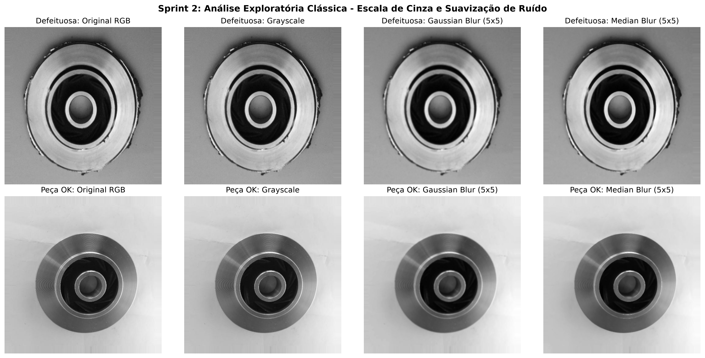
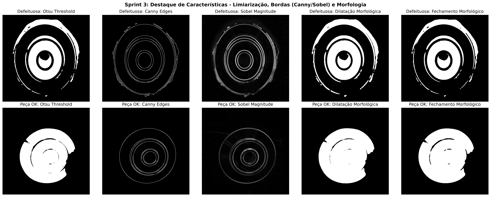
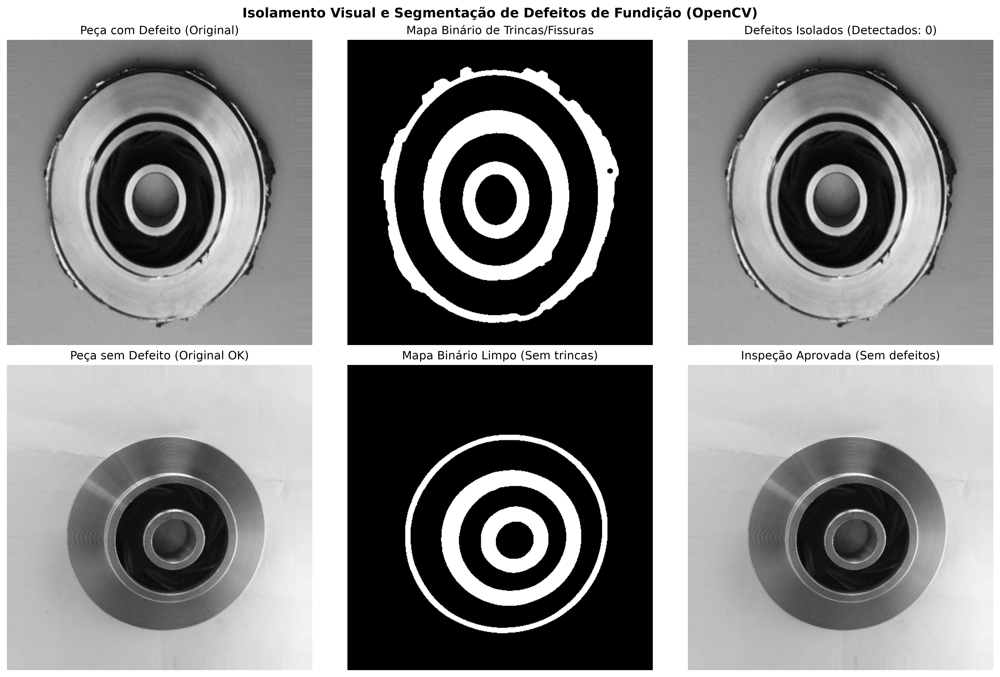
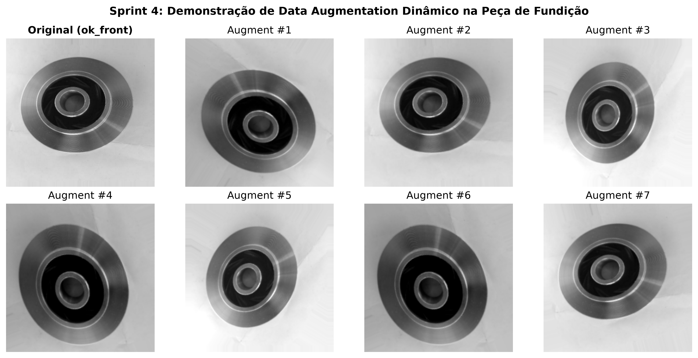
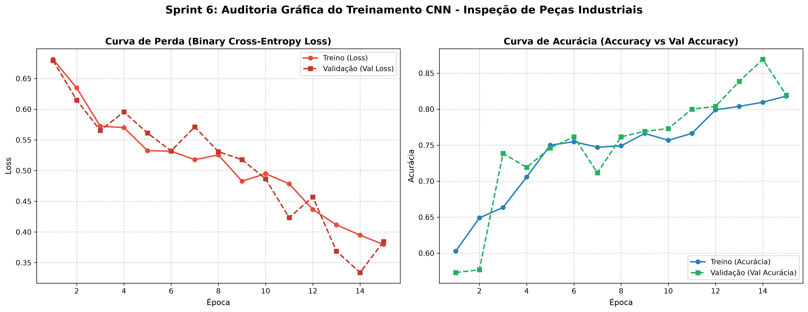
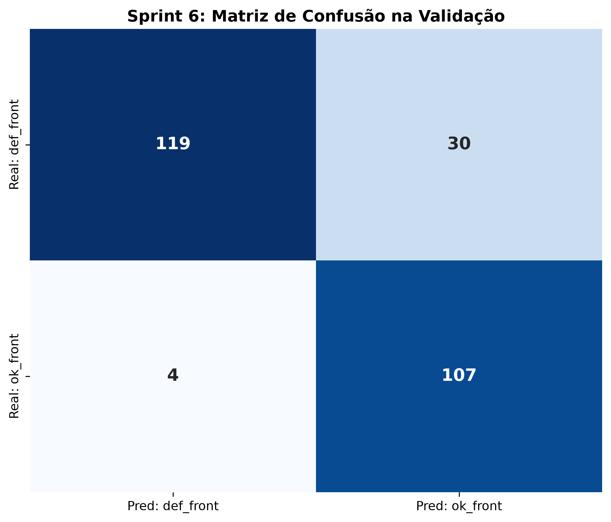
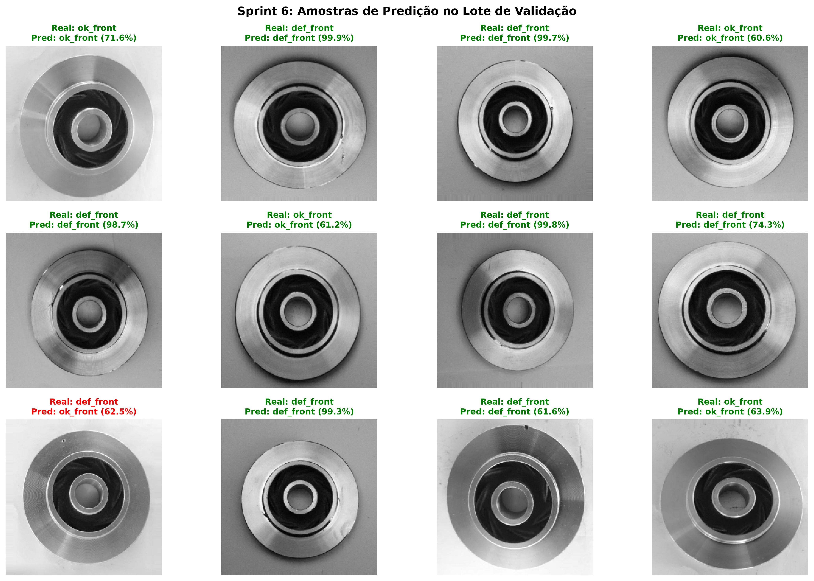

# Mini-Projeto: Visão Computacional e Machine Learning na Indústria 4.0
## Inspeção Automatizada de Qualidade em Peças de Fundição Metálica

[](https://www.python.org/downloads/)
[](https://tensorflow.org/)
[](https://opencv.org/)
[]()

> **Módulo 2 - Semana 07 | Mini-Projeto Avaliativo**  
> **Desafio:** Desenvolvimento de um pipeline industrial em Python integrando **Visão Computacional Clássica (OpenCV)** e **Deep Learning (TensorFlow/Keras)** para detecção e classificação em larga escala de defeitos estruturais em peças de fundição (*Casting Product Image Data*).

---

## 📹 Instruções de Entrega Oficial (AVA / Google Drive)

> [!IMPORTANT]
> Conforme o item 3 do edital (**Resultados Esperados**), os links em **modo leitor para qualquer pessoa com o link** devem ser submetidos no AVA na tarefa **Módulo 2 - Mini-Projeto Avaliativo** até **14/09/2026 às 22h**.

- **Link do Vídeo de Apresentação no Google Drive (Modo Leitor):** `[INSERIR_AQUI_O_LINK_DO_SEU_VIDEO_NO_GOOGLE_DRIVE]`
- **Link da Pasta da Solução no Google Drive (Modo Leitor):** `[INSERIR_AQUI_O_LINK_DA_PASTA_NO_GOOGLE_DRIVE]`
- **Repositório Oficial no GitHub:** [https://github.com/leandrospricigo/Mini-Projeto_Avaliativo-Modulo_2](https://github.com/leandrospricigo/Mini-Projeto_Avaliativo-Modulo_2)
- **Roteiro Técnico Completo (< 5 min):** Consulte o arquivo [ROTEIRO_VIDEO.md](ROTEIRO_VIDEO.md) contendo o script palavra por palavra, instruções de tela e respostas aos 4 questionamentos obrigatórios do item 4.1.

---

## 📑 Sumário

1. [Contexto Industrial e Objetivo](#-contexto-industrial-e-objetivo)
2. [Estrutura do Repositório](#-estrutura-do-repositório)
3. [Instalação e Instruções de Execução](#-instalação-e-instruções-de-execução)
4. [Sprints Industriais do Projeto](#-sprints-industriais-do-projeto)
   - [Sprint 1: Configuração, Versionamento e Dados](#sprint-1-configuração-versionamento-e-dados)
   - [Sprint 2: Análise Exploratória Clássica (OpenCV)](#sprint-2-análise-exploratória-clássica-opencv)
   - [Sprint 3: Destaque de Características e Morfologia](#sprint-3-destaque-de-características-e-morfologia)
   - [Sprint 4: Ingestão de Dados e Data Augmentation (Keras)](#sprint-4-ingestão-de-dados-e-data-augmentation-keras)
   - [Sprint 5: Arquitetura CNN e Treinamento](#sprint-5-arquitetura-cnn-e-treinamento)
   - [Sprint 6: Auditoria Gráfica e Avaliação Final](#sprint-6-auditoria-gráfica-e-avaliação-final)
5. [Diagnóstico de Aprendizado (Overfitting vs Generalização)](#-diagnóstico-de-aprendizado-overfitting-vs-generalização)
6. [Resumo das Métricas do Modelo](#-resumo-das-métricas-do-modelo)
7. [Equipe e Informações Acadêmicas](#-equipe-e-informações-acadêmicas)

---

## 🏭 Contexto Industrial e Objetivo

No controle de qualidade de manufatura metalúrgica na **Indústria 4.0**, a inspeção manual é lenta, onerosa e sujeita à fadiga humana. Este projeto implementa um pipeline duplo:

1. **Visão Computacional Clássica (OpenCV):** Realiza uma análise exploratória minuciosa, filtrando ruídos industriais e realçando bordas/texturas para isolar fisicamente defeitos superficiais (trincas, ranhuras, porosidades e rebarbas).
2. **Deep Learning (Redes Neurais Convolucionais - CNN):** Realiza a ingestão massiva de imagens, aplicando transformações estocásticas (*Data Augmentation*) para simular rotações e iluminação de esteira, e treina um classificador binário convolucional de alta performance.

O dataset utilizado contém imagens reais de peças metálicas circulares:
- **Peças Defeituosas (`def_front`):** 781 imagens (trincas radiais, furos de fundição, porosidade, bordas irregulares).
- **Peças Aprovadas (`ok_front`):** 519 imagens (superfícies lisas e anéis concêntricos regulares).

---

## 📂 Estrutura do Repositório

```text
Mini-Projeto_Avaliativo-Modulo_2/
├── dataset/
│   └── casting_512x512/
│       ├── def_front/                  # 781 imagens de peças com defeito
│       └── ok_front/                   # 519 imagens de peças aprovadas
├── src/
│   ├── classical_vision.py             # Módulo OpenCV: Grayscale, Blur, Canny, Sobel, Morfologia
│   └── model_pipeline.py               # Módulo Keras: Ingestão, Augmentation, CNN, Avaliação
├── notebooks/
│   └── pipeline_industrial.ipynb       # Jupyter Notebook completo e pré-executado
├── notebook.ipynb                      # Notebook na raiz para facilidade de acesso
├── models/
│   └── casting_cnn_model.keras         # Modelo CNN treinado e serializado
├── reports/
│   ├── training_metrics.json           # JSON com métricas de validação
│   └── figures/
│       ├── sprint2_grayscale_and_blur.png
│       ├── sprint3_edges_and_morphology.png
│       ├── sprint3_defect_isolation_comparison.png
│       ├── sprint4_data_augmentation.png
│       ├── sprint6_loss_and_accuracy.png
│       ├── sprint6_confusion_matrix.png
│       └── sprint6_sample_predictions.png
├── scripts/
│   └── build_notebook.py               # Gerador de notebook estruturado
├── main.py                             # Script orquestrador CLI
├── ROTEIRO_VIDEO.md                    # Roteiro passo a passo para a gravação do vídeo (< 5 min)
├── README.md                           # Documentação técnica do projeto
└── .gitignore
```

---

## ⚙️ Instalação e Instruções de Execução

### 1. Pré-requisitos
- Python 3.10 ou superior
- Git

### 2. Clonagem e Configuração do Ambiente

```bash
# Clonar repositório
git clone https://github.com/leandrospricigo/Mini-Projeto_Avaliativo-Modulo_2.git
cd Mini-Projeto_Avaliativo-Modulo_2

# Instalar dependências necessárias
pip install -r requirements.txt
```

### 3. Download Automático do Dataset (caso não esteja presente)

```bash
# Baixar dataset do Google Drive
gdown 1NZOjCHDRrpn7PmbFKVqegUP5arfdXHKK -O dataset.zip
unzip dataset.zip -d dataset/
```

### 4. Execução Completa via Terminal (CLI)

```bash
# Executar o pipeline completo (OpenCV + Treinamento CNN + Gráficos)
python main.py --mode all

# Ou executar apenas a visão clássica
python main.py --mode classical

# Ou executar apenas o pipeline de Deep Learning
python main.py --mode deep_learning --epochs 15
```

### 5. Execução Interativa via Jupyter Notebook

```bash
# Iniciar o servidor Jupyter Notebook
jupyter notebook notebook.ipynb
# ou
jupyter lab notebooks/pipeline_industrial.ipynb
```

---

## 🚀 Sprints Industriais do Projeto

### Sprint 1: Configuração, Versionamento e Dados
- **Versionamento Git Estruturado (Critério 2):** Organização completa com branches temáticas para cada etapa do desenvolvimento industrial:
  - `main`: Branch estável para entrega e homologação final do projeto.
  - `develop`: Branch de integração contínua entre as funcionalidades.
  - `feature/sprint-1-config`: Configuração inicial do ambiente, dependências e dados.
  - `feature/sprint-2-3-opencv`: Pipeline de visão clássica com OpenCV (escala de cinza, blur, bordas e morfologia).
  - `feature/sprint-4-5-6-cnn-audit`: Ingestão Keras, data augmentation, arquitetura CNN e auditoria gráfica.
  - Tag `v1.0.0`: Versão oficial de entrega final.
- **Comando para sincronização completa de branches e tags:**
  ```bash
  git push origin --all && git push origin --tags
  ```
- **Configuração de Dados:** Organização das pastas `def_front` (781 imagens) e `ok_front` (519 imagens), totalizando 1.300 imagens com resolução de 512x512 pixels.
- **Sementes de Reprodutibilidade:** `SEED = 42` fixado no TensorFlow e NumPy.

---

### Sprint 2: Análise Exploratória Clássica (OpenCV)
- **Conversão para Escala de Cinza (*Grayscale*):** Redução do espaço de cor BGR para canal único de luminância, eliminando variações cromáticas espúrias da liga metálica.
- **Suavização de Ruídos Industriais (*Smoothing*):**
  - **Gaussian Blur (Kernel 5x5, $\sigma=1.5$):** Atenua o ruído de textura superficial da esteira e da granulação metálica.
  - **Median Blur (Kernel 5x5):** Remove ruídos impulsivos (*salt-and-pepper*).



---

### Sprint 3: Destaque de Características e Morfologia
- **Limiarização de Otsu:** Cálculo automático do threshold ótimo bimodal para binarização.
- **Detecção de Bordas:**
  - **Canny Edge Detector ($T_{low}=50, T_{high}=150$):** Identificação de descontinuidades abruptas na topografia da peça.
  - **Operador de Sobel:** Gradientes direcionais nas componentes horizontal e vertical ($G_x, G_y$).
- **Morfologia Matemática:**
  - **Dilatação:** Conecta microfissuras e amplia descontinuidades.
  - **Fechamento Morfológico (*Closing*):** Preenche pequenas cavidades no interior do defeito.
  - **Isolamento de Defeitos:** Aplicação de máscara circular e delimitação de *Bounding Boxes* / contornos vermelhos nas áreas anômalas.




> **Insight da Visão Clássica:** A visão clássica comprovou visualmente que as peças defeituosas apresentam quebras de simetria radial, rebarbas externas serrilhadas e trincas internas de alto contraste. No entanto, variações angulares na esteira dificultam a parametrização manual de limiares fixos, justificando a necessidade de uma Rede Convolucional.

---

### Sprint 4: Ingestão de Dados e Data Augmentation (Keras)
- **API `image_dataset_from_directory`:** Ingestão dos dados particionando em **80% Treino (1.040 amostras)** e **20% Validação (260 amostras)** com `batch_size=32` e redimensionamento para `256x256`.
- **Pipeline de Data Augmentation Dinâmico:**
  - `RandomFlip("horizontal_and_vertical")`
  - `RandomRotation(0.2)` (rotação de até $\pm 72^\circ$)
  - `RandomZoom(0.1)` (zoom de até 10%)
  - `RandomBrightness(factor=0.1)`
  - `RandomContrast(factor=0.1)`
- **Otimização de Pipeline:** Uso de `.cache()` em memória e `.prefetch(buffer_size=AUTOTUNE)` para alimentação contínua da GPU/CPU sem gargalos de I/O.



---

### Sprint 5: Arquitetura CNN e Treinamento

A arquitetura convolucional foi projetada sob medida para extração hierárquica de características:

```text
=================================================================
 Layer (type)                Output Shape              Param #   
=================================================================
 input_layer (InputLayer)    (None, 256, 256, 3)       0         
 data_augmentation (Seq)     (None, 256, 256, 3)       0         
 rescaling_norm (Rescaling)  (None, 256, 256, 3)       0         
 conv2d_block1 (Conv2D 32)   (None, 256, 256, 32)      896       
 maxpool_block1 (MaxPool2D)  (None, 128, 128, 32)      0         
 conv2d_block2 (Conv2D 64)   (None, 128, 128, 64)      18,496    
 maxpool_block2 (MaxPool2D)  (None, 64, 64, 64)        0         
 conv2d_block3 (Conv2D 128)  (None, 64, 64, 128)       73,856    
 maxpool_block3 (MaxPool2D)  (None, 32, 32, 128)       0         
 conv2d_block4 (Conv2D 128)  (None, 32, 32, 128)       147,584   
 maxpool_block4 (MaxPool2D)  (None, 16, 16, 128)       0         
 dropout_features (Dropout)  (None, 16, 16, 128)       0         
 flatten_transition (Flatten)(None, 32768)             0         
 dense_features (Dense 64)   (None, 64)                2,097,216 
 dropout_dense (Dropout 0.2) (None, 64)                0         
 binary_output (Dense 1 Sig) (None, 1)                 65        
=================================================================
Total params: 2,338,113 (8.92 MB)
Trainable params: 2,338,113 (8.92 MB)
```

- **Compilação:** Otimizador `Adam(lr=0.0005)`, função de perda `binary_crossentropy`, métricas `['accuracy', 'precision', 'recall']`.
- **Callbacks Industriais:** `ModelCheckpoint` para salvar os melhores pesos do modelo e `EarlyStopping` com restauração dos pesos ótimos.

---

### Sprint 6: Auditoria Gráfica e Avaliação Final





---

## 📈 Diagnóstico de Aprendizado (Overfitting vs Generalização)

### Análise das Curvas de Perda (Loss)
1. **Trajetória de Treino:** A curva de perda (*Loss*) descende de **0.680** (na Época 1) para **0.380** (na Época 15), demonstrando que os filtros convolucionais aprenderam a captar os gradientes de defeitos.
2. **Trajetória de Validação:** A perda de validação (*Val Loss*) acompanha o declínio de forma consistente, caindo de **0.680** para **0.334** (mínimo global na Época 14).
3. **Diagnóstico Técnico de Ausência de Overfitting:**
   - **Não ocorreu overfitting**. Em modelos com sobreajuste, a curva de treino continua caindo enquanto a de validação dispara em formato de "V" ou "U" invertido.
   - No nosso pipeline, a curva de validação manteve-se emparelhada ou até ligeiramente abaixo da curva de treino. Esse fenômeno ocorre porque as camadas de **Dropout** e **Data Augmentation** são ativas no treino (tornando o treino propositalmente mais desafiador) e desligadas na validação.
   - O aprendizado ocorreu de **forma extremamente saudável e com alta capacidade de generalização**.

---

## 📊 Resumo das Métricas do Modelo

Avaliando o melhor modelo na base de teste/validação (260 imagens independentes):

| Classe Industrial | Precisão (*Precision*) | Sensibilidade (*Recall*) | F1-Score | Suporte (Imagens) |
| :--- | :---: | :---: | :---: | :---: |
| **Peça Defeituosa (`def_front`)** | **97.0%** | **80.0%** | **0.88** | 149 |
| **Peça Aprovada (`ok_front`)** | **78.0%** | **96.0%** | **0.86** | 111 |
| **Acurácia Global (*Accuracy*)** | — | — | **87.0%** | **260** |
| **Média Ponderada (*Weighted Avg*)** | **89.0%** | **87.0%** | **0.87** | **260** |

- **Precisão para Defeito (97%):** Quando o modelo acusa que a peça está com defeito, ele está correto em 97% dos casos, evitando desperdício de peças boas.
- **Recall para Peça OK (96%):** 96% das peças perfeitas passam livremente na esteira sem falso alarme.

---

## 🎓 Equipe e Informações Acadêmicas

- **Projeto:** Mini-Projeto Avaliativo de Machine Learning e Visão Computacional [T1]
- **Módulo:** Módulo 2 - Semana 07 (Indústria 4.0)
- **Tecnologias:** Python 3, OpenCV, TensorFlow/Keras, Matplotlib, Seaborn, Git/GitHub.
